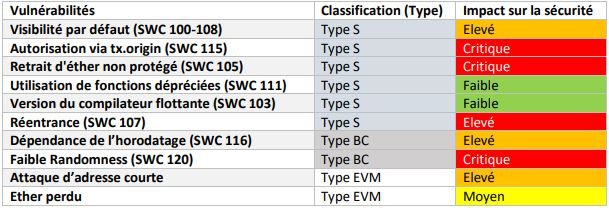

# SolditiyCode :
répertoire Git contenant les différents codes source utilisés pour le comparatif des outils d'analyse des contrats intelligents pour le langage Solidity d'Etherium.

## Plan d'action : 
  1.	Choix des outils à étudier
  2.	Comprendre la logique du langage Solidity
  3.	Identifier les failles de sécurités à étudier et les classifier
  4.	Produire des exemples de codes contenant ces failles
  5.	Présenter le fonctionnement des différents outils (Approches, stratégies, mécanismes)
  6.	Etudier et comparer le comportement des outils par apport aux failles sélectionnées sur plusieurs critères
  7. Enjeux de la détection des bogues pour la sécurité des contrats intelligents

## 1. Outils d'analyse statiques et dynamiques : 
  1.	SmartCheck (Analyse statique) : https://github.com/smartdec/smartcheck
  2.	Slither (Analyse statique) : https://github.com/crytic/slither
  3.	Myhtril (Interprétation symbolique) : https://github.com/ConsenSys/mythril
  4.	Manticore (Interprétation symbolique) : https://github.com/trailofbits/manticore
  5.	Securify (Analyse statique) : https://securify.chainsecurity.com/
  
### Autres outils : 
  1. Echidna (Fuzzer):   https://github.com/crytic/echidna
  2. Solidity Visual Auditor: (Visualisation): https://marketplace.visualstudio.com/items?itemName=tintinweb.solidity-visual-auditor
  3. Solhint (Linter): https://protofire.github.io/solhint/
  
## 2. Logique Solidity :
  1. Documentation officielle : https://solidity.readthedocs.io/en/v0.6.4/
  2. Tutoriel Solidity : https://www.youtube.com/watch?v=ipwxYa-F1uY

## 3. Failles à étudier : Les déscriptions sont disponibles dans les sous-dossiers
  1. Visibilité des fonctions et variables par défaut (SWC100 et SWC 108)
  2. Retrait d'éther non protégé (SWC 105)
  3. Réentrance (SWC 107)
  4. Autorisation via tx.origin (SWC 115)
  5. Version du compilateur flottante (SWC 103)
  6. Utilisation des fonctions Solidity dépréciées (SWC 111)
  7. Dépendance de l’horodatage -Timestamp- (SWC 116)
  8. Faibles sources de génération d’attributs aléatoires (SWC 120)
  9. Attaque d’adresse courte
  10. Ether perdu type
  11. Schémas de Ponzi
  
### Classification

 
